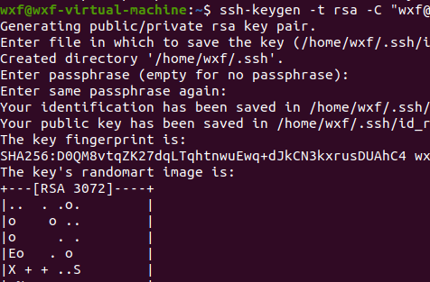
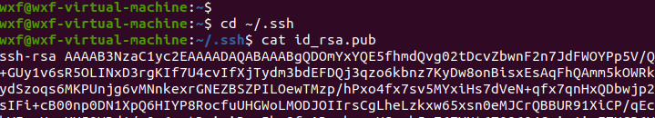
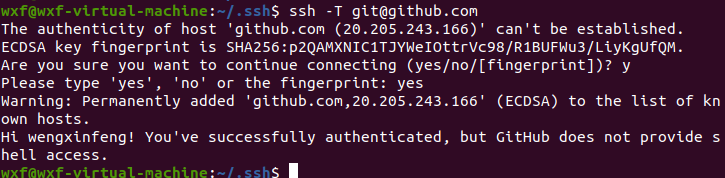

## 1引言

在push项目的时候，如果用https的方式，每次都需要输入账号密码，而采用ssh的方式，就不再需要输入，只需要在GitHub账号下配置一个ssh key即可。

## 2配置SSH

git使用SSH配置：

1. 使用秘钥生成工具生成rsa秘钥和公钥；
2. 将rsa公钥添加到代码托管平台；
3. 将rsa秘钥添加到ssh-agent中，为ssh client指定使用的秘钥文件；

具体如下：

1. 检查本地主机是否已经存在ssh key

```c++
cd ~/.ssh
ls
//查看是否存在 id_rsa 和 id_rsa.pub文件，如果存在，说明已经有SSH Key
```

不存在时：


已经存在会没有提示。

2. 生成ssh key

如果不存在ssh key，使用以下命令生成：

```c++
ssh-keygen -t rsa -C "xxx@xxx.com"
//一直回车即可
```



3. 获取ssh key公钥内容（id_rsa.pub)

```c++
cd ~/.ssh
cat id_rsa.pub
```



4. GitHub账号上添加公钥

进入setting，添加`new ssh key`，把公钥内容复制上去即可。

5. 验证是否设置成功

```c++
ssh -T git@github.com
```

如成功会显示下面信息：



设置成功后，即可不需要账号密码clone和push代码了

**注意之后clone仓库的时候要使用ssh的URL，不要用HTTPS的**

